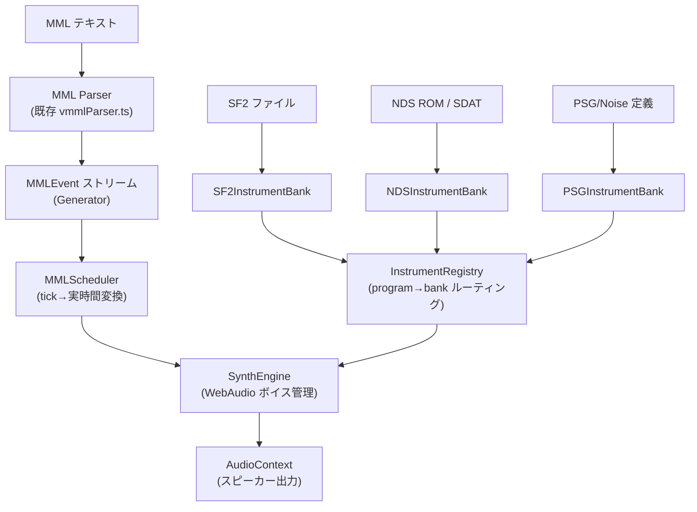
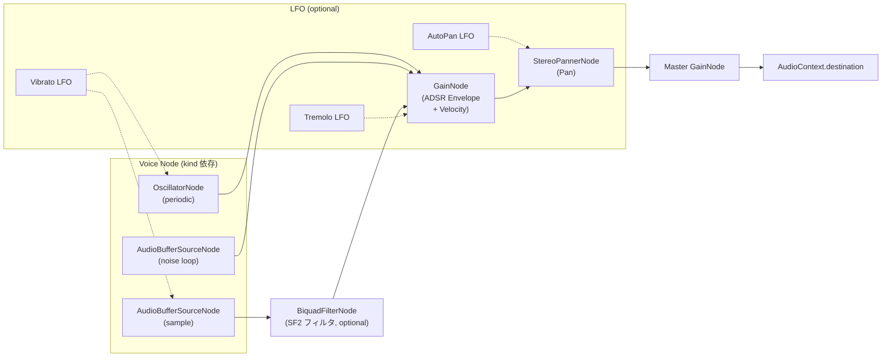

# WebAudio MML Player — 音源抽象化アーキテクチャ設計

## 概要

MMLパーサー (`src/parser/`) が出力する `MMLEvent` ストリームを、WebAudio API でリアルタイム再生するためのアーキテクチャ設計。
3種類の音源（SF2, NDS ROM, PSG/Noise）を統一的に扱うための抽象化レイヤーを定義する。

---

## 全体構成



---

## レイヤー構成

### Layer 0: データ型（WebAudio 非依存）

音源の種類に関わらず、ボイスの発音に必要な情報を統一的に表現する。

```typescript
// ── サンプルベース音源（SF2, NDS の PCM 楽器）──
interface SampleVoiceData {
  kind: 'sample';
  pcm: Float32Array;         // 正規化済み [-1.0, 1.0]
  sampleRate: number;
  rootKey: number;           // 収録ピッチの MIDI ノート番号
  fineTune: number;          // セント単位の微調整
  loop: boolean;
  loopStart: number;         // サンプル数単位
  loopEnd: number;
  // SF2 / NDS の音源固有デフォルト ADSR
  defaultEnvelope: ADSRParams;
  // SF2 ゾーンのフィルタ情報（あれば）
  filter?: { cutoffHz: number; resonanceDb: number };
  // 音量減衰（centibels → リニアゲインに変換済み）
  attenuation: number;       // 0.0 〜 1.0
  // デフォルトパン（-1.0 左 〜 +1.0 右, 0.0 中央）
  defaultPan: number;
}

// ── 波形生成音源（PSG 矩形波）──
interface PeriodicVoiceData {
  kind: 'periodic';
  waveform: Float32Array;    // 1周期分の波形データ（例: 256 サンプル）
  // または harmonics で指定
  harmonics?: { real: Float32Array; imag: Float32Array };
  defaultEnvelope: ADSRParams;
}

// ── ノイズ音源 ──
interface NoiseVoiceData {
  kind: 'noise';
  // ノイズ種別。'white' | 'pink' | 'lfsr' (NDS 風 LFSR ノイズ)
  noiseType: 'white' | 'lfsr';
  defaultEnvelope: ADSRParams;
}

// ── 統合型 ──
type VoiceData = SampleVoiceData | PeriodicVoiceData | NoiseVoiceData;

// ── ADSR パラメータ（秒単位、合成エンジンがそのまま使える形）──
interface ADSRParams {
  attackTime: number;   // 秒
  decayTime: number;    // 秒
  sustainLevel: number; // 0.0 〜 1.0
  releaseTime: number;  // 秒
}
```

> [!NOTE]
> SmileBASIC の `@E` は 0〜127 の独自単位。MML の `@E` が有効な場合はこの値を秒に変換して `defaultEnvelope` を**上書き**する。
> `@ER` 時は音源側のデフォルトに戻す。

---

### Layer 1: InstrumentBank（音源ローダー — WebAudio 非依存）

各音源フォーマットのパース・サンプル抽出を担当。WebAudio API には**一切依存しない**。

```typescript
interface InstrumentBank {
  readonly name: string;

  /**
   * 音源データをロード（非同期: ファイル読み込み・デコード）
   */
  load(data: ArrayBuffer): Promise<void>;

  /**
   * 指定 program 番号を扱えるか
   */
  hasProgram(program: number): boolean;

  /**
   * 指定の program + noteNumber + velocity に対応する
   * VoiceData を返す（SF2 のゾーン選択・NDS のキースプリット等を内部で解決）
   */
  getVoice(program: number, noteNumber: number, velocity: number): VoiceData | null;

  /**
   * リソース解放
   */
  dispose(): void;
}
```

#### 具体実装 3 つ

| クラス | 対象 program | 内部ライブラリ | 備考 |
|:---|:---|:---|:---|
| `SF2InstrumentBank` | `@0`〜`@127` (GM メロディ), `@128`〜`@129` (ドラム) | `@marmooo/soundfont-parser` | Preset→Instrument→Sample のゾーンチェーン走査。`decodePCM()` → `Float32Array`。SF2 ADSR の timecent→秒変換。 |
| `NDSInstrumentBank` | 全 program（ROM 内定義に従う） | `nitro-fs` | SDAT→SBNK→SWAR→SWAV。`swav.toPCM()` → `Float32Array`。NDS ハードウェア ADSR テーブルで秒変換。PSG/Noise 楽器は `PeriodicVoiceData` / `NoiseVoiceData` として返す。 |
| `PSGInstrumentBank` | `@144`〜`@150` (矩形波), `@151` (ノイズ) | なし（JS で波形生成） | デューティ比: 12.5%, 25%, 37.5%, 50%, 62.5%, 75%, 87.5%。ノイズは LFSR or ホワイトノイズ。 |

---

### Layer 2: InstrumentRegistry（ルーティング）

複数の `InstrumentBank` を束ね、program 番号に応じて適切な bank にルーティングする。

```typescript
class InstrumentRegistry {
  private banks: InstrumentBank[] = [];
  // program → bank の明示的マッピング（優先）
  private explicitMap: Map<number, InstrumentBank> = new Map();

  /**
   * bank を登録。後から登録したものが優先（フォールバックチェーン）
   */
  register(bank: InstrumentBank, programs?: number[]): void {
    if (programs) {
      for (const p of programs) this.explicitMap.set(p, bank);
    }
    this.banks.push(bank);
  }

  /**
   * program + noteNumber + velocity → VoiceData
   * 明示マッピング → 登録順（逆順）で hasProgram チェック
   */
  getVoice(program: number, noteNumber: number, velocity: number): VoiceData | null {
    // 1. 明示マッピング優先
    const explicit = this.explicitMap.get(program);
    if (explicit) {
      const voice = explicit.getVoice(program, noteNumber, velocity);
      if (voice) return voice;
    }
    // 2. 登録逆順でフォールバック
    for (let i = this.banks.length - 1; i >= 0; i--) {
      if (this.banks[i].hasProgram(program)) {
        const voice = this.banks[i].getVoice(program, noteNumber, velocity);
        if (voice) return voice;
      }
    }
    return null;
  }
}
```

**使用例:**

```typescript
const registry = new InstrumentRegistry();

// PSG は常に利用可能（フォールバック最下層）
const psg = new PSGInstrumentBank();
registry.register(psg);

// SF2 を GM 音源として登録
const sf2 = new SF2InstrumentBank();
await sf2.load(sf2ArrayBuffer);
registry.register(sf2);

// NDS ROM があればそちらを最優先に（全 program を上書き）
if (ndsRomBuffer) {
  const nds = new NDSInstrumentBank();
  await nds.load(ndsRomBuffer);
  registry.register(nds); // 最後に登録 → 最優先
}
```

---

### Layer 3: SynthEngine（WebAudio ボイスレンダリング）

`VoiceData` を受け取り、WebAudio ノードグラフを構築して発音する。
**音源の種類によらず統一的にエンベロープ・モジュレーション・パンを制御。**

```typescript
class SynthEngine {
  private ctx: AudioContext;
  private masterGain: GainNode;
  private registry: InstrumentRegistry;
  private activeVoices: Map<string, ActiveVoice> = new Map();

  constructor(ctx: AudioContext, registry: InstrumentRegistry) {
    this.ctx = ctx;
    this.registry = registry;
    this.masterGain = ctx.createGain();
    this.masterGain.connect(ctx.destination);
  }

  /**
   * ノートオン
   */
  noteOn(event: NoteEvent, startTime: number): void {
    const voiceData = this.registry.getVoice(
      event.program, event.noteNumber, event.velocity
    );
    if (!voiceData) return;

    // ADSR: MML @E が有効ならそちらを使用、なければ音源デフォルト
    const envelope = event.envelope.enabled
      ? convertSmileBASICEnvelope(event.envelope)  // 0-127 → 秒
      : voiceData.defaultEnvelope;

    const voice = this.createVoiceNode(voiceData, event, envelope, startTime);
    const key = `${event.channel}-${event.noteNumber}`;
    this.activeVoices.set(key, voice);
  }

  /**
   * VoiceData の kind に応じた音源ノード生成
   */
  private createVoiceNode(
    data: VoiceData, event: NoteEvent,
    envelope: ADSRParams, startTime: number
  ): ActiveVoice {
    // ── 共通ノード ──
    const gainNode = this.ctx.createGain();
    const panNode = this.ctx.createStereoPanner();
    panNode.pan.value = (event.pan - 64) / 64;
    gainNode.connect(panNode).connect(this.masterGain);

    // ベロシティゲイン
    const velGain = event.velocity / 127;

    let sourceNode: AudioScheduledSourceNode;

    switch (data.kind) {
      case 'sample': {
        const bufSrc = this.ctx.createBufferSource();
        const buf = this.ctx.createBuffer(1, data.pcm.length, data.sampleRate);
        buf.copyToChannel(data.pcm, 0);
        bufSrc.buffer = buf;

        // ピッチ調整
        const semitones = event.noteNumber - data.rootKey + data.fineTune / 100
                          + event.detune / 100;
        bufSrc.playbackRate.value = Math.pow(2, semitones / 12);

        // ループ
        if (data.loop) {
          bufSrc.loop = true;
          bufSrc.loopStart = data.loopStart / data.sampleRate;
          bufSrc.loopEnd = data.loopEnd / data.sampleRate;
        }

        // SF2 フィルタ
        if (data.filter) {
          const biquad = this.ctx.createBiquadFilter();
          biquad.type = 'lowpass';
          biquad.frequency.value = data.filter.cutoffHz;
          biquad.Q.value = data.filter.resonanceDb;
          bufSrc.connect(biquad).connect(gainNode);
        } else {
          bufSrc.connect(gainNode);
        }

        sourceNode = bufSrc;
        break;
      }

      case 'periodic': {
        const osc = this.ctx.createOscillator();
        if (data.harmonics) {
          const wave = this.ctx.createPeriodicWave(
            data.harmonics.real, data.harmonics.imag
          );
          osc.setPeriodicWave(wave);
        }
        osc.frequency.value = midiNoteToFreq(event.noteNumber, event.detune);
        osc.connect(gainNode);
        sourceNode = osc;
        break;
      }

      case 'noise': {
        // ノイズバッファを生成して AudioBufferSourceNode でループ再生
        const noiseBuf = generateNoiseBuffer(this.ctx, data.noiseType);
        const noiseSrc = this.ctx.createBufferSource();
        noiseSrc.buffer = noiseBuf;
        noiseSrc.loop = true;
        noiseSrc.connect(gainNode);
        sourceNode = noiseSrc;
        break;
      }
    }

    // ── ADSR エンベロープ（GainNode で制御）──
    this.applyEnvelope(gainNode, envelope, velGain, startTime);

    // ── モジュレーション（LFO）──
    if (event.modulation.enabled) {
      this.applyModulation(sourceNode, gainNode, panNode, event.modulation, startTime);
    }

    sourceNode.start(startTime);

    return { sourceNode, gainNode, panNode, envelope, startTime };
  }

  // ... applyEnvelope, applyModulation, noteOff, portamento glide 等
}
```

> [!IMPORTANT]
> `SynthEngine` は `VoiceData.kind` の switch で音源ノードの**生成方法だけ**を分岐する。
> エンベロープ・パン・ベロシティ・モジュレーションの適用ロジックは**全 kind 共通**。
> これが抽象化の核心。

---

### Layer 4: MMLScheduler（再生スケジューラ）

パーサーの tick ベースイベントを実時間に変換し、`SynthEngine` を駆動する。

```typescript
class MMLScheduler {
  private synth: SynthEngine;
  private events: MMLEvent[];
  private tempoMap: TempoMap;       // tick → BPM のマッピング
  private ticksPerQuarter: number;
  private startTime: number = 0;
  private scheduledUpto: number = 0;
  private isPlaying: boolean = false;

  // 先読みスケジューリング（100ms 単位でバッファ）
  private readonly LOOK_AHEAD_SEC = 0.1;
  private readonly SCHEDULE_INTERVAL_MS = 25;
  private schedulerTimer: number | null = null;

  constructor(synth: SynthEngine, events: MMLEvent[], ticksPerWholeNote: number) {
    this.synth = synth;
    this.events = events;
    this.ticksPerQuarter = ticksPerWholeNote / 4;
    this.tempoMap = this.buildTempoMap(events);
  }

  play(): void {
    this.startTime = this.synth.currentTime;
    this.isPlaying = true;
    this.scheduleLoop();
  }

  private scheduleLoop(): void {
    const now = this.synth.currentTime;
    const scheduleUntil = now + this.LOOK_AHEAD_SEC;

    while (this.scheduledUpto < this.events.length) {
      const event = this.events[this.scheduledUpto];
      const eventTime = this.startTime + this.tickToTime(event.tick);

      if (eventTime > scheduleUntil) break;

      this.dispatchEvent(event, eventTime);
      this.scheduledUpto++;
    }

    if (this.isPlaying && this.scheduledUpto < this.events.length) {
      this.schedulerTimer = window.setTimeout(
        () => this.scheduleLoop(),
        this.SCHEDULE_INTERVAL_MS
      );
    }
  }

  /**
   * tick → 秒変換（テンポマップ参照）
   */
  private tickToTime(tick: number): number {
    // テンポマップの各区間を積算して実時間を計算
    // ...
  }
}
```

---

## 各 InstrumentBank 実装の詳細

### SF2InstrumentBank

```typescript
import { parse, SoundFont } from '@marmooo/soundfont-parser';

class SF2InstrumentBank implements InstrumentBank {
  readonly name = 'SF2';
  private sf: SoundFont | null = null;

  // program → GM preset マッピング
  // @0-127: bank 0, preset 0-127 (メロディ)
  // @128:   bank 128, preset 0 (Standard Drums)
  // @129:   bank 128, preset 25 (Electronic Drums) — または preset 番号は SF2 に依存

  async load(data: ArrayBuffer): Promise<void> {
    const parsed = parse(new Uint8Array(data));
    this.sf = new SoundFont(parsed);
  }

  hasProgram(program: number): boolean {
    return program >= 0 && program <= 129;
  }

  getVoice(program: number, noteNumber: number, velocity: number): VoiceData | null {
    if (!this.sf) return null;

    const { bank, preset } = this.mapProgram(program);
    const voices = this.sf.getVoices(bank, preset, noteNumber);

    if (voices.length === 0) return null;
    // velocity レイヤーの選択
    const voice = this.selectByVelocity(voices, velocity);

    return {
      kind: 'sample',
      pcm: voice.audioData.decodePCM(),
      sampleRate: voice.sampleRate,
      rootKey: voice.rootKey,
      fineTune: voice.fineTune,
      loop: voice.sampleModes === 1,
      loopStart: voice.startLoop,
      loopEnd: voice.endLoop,
      defaultEnvelope: {
        attackTime: timecentToSecond(voice.attackVolEnv),
        decayTime: timecentToSecond(voice.decayVolEnv),
        sustainLevel: centibelsToGain(voice.sustainVolEnv),
        releaseTime: timecentToSecond(voice.releaseVolEnv),
      },
      filter: voice.initialFilterFc ? {
        cutoffHz: centToHz(voice.initialFilterFc),
        resonanceDb: voice.initialFilterQ / 10,
      } : undefined,
      attenuation: centibelsToGain(voice.initialAttenuation),
      defaultPan: voice.pan ? voice.pan / 500 : 0, // SF2 pan: -500..+500
    };
  }

  private mapProgram(program: number): { bank: number; preset: number } {
    if (program <= 127) return { bank: 0, preset: program };
    if (program === 128) return { bank: 128, preset: 0 };   // Standard
    if (program === 129) return { bank: 128, preset: 25 };  // Electronic
    return { bank: 0, preset: 0 };
  }
}
```

---

### NDSInstrumentBank

```typescript
import { NitroFS, Audio } from 'nitro-fs';

class NDSInstrumentBank implements InstrumentBank {
  readonly name = 'NDS';
  private sdat: Audio.SDAT | null = null;

  // program → SBNK instrument index マッピングテーブル
  // (SmileBASIC の @番号 → SBNK 内の instrument ID の対応表)
  private instrumentMap: Map<number, {
    bankIndex: number;
    instrumentIndex: number;
  }> = new Map();

  async load(data: ArrayBuffer): Promise<void> {
    const fs = NitroFS.fromRom(data);
    // sound_data.sdat を検索して読み込み
    const sdatFile = fs.readFile('/data/sound/sound_data.sdat');
    this.sdat = new Audio.SDAT(sdatFile.buffer);
    this.buildInstrumentMap();
  }

  getVoice(program: number, noteNumber: number, velocity: number): VoiceData | null {
    const mapping = this.instrumentMap.get(program);
    if (!mapping || !this.sdat) return null;

    const sbnk = this.sdat.fs.banks[mapping.bankIndex];
    const instrument = sbnk.instruments[mapping.instrumentIndex];

    // 楽器の種類に応じて分岐
    if (instrument.type === 'psg') {
      // NDS PSG → PeriodicVoiceData として返す
      return this.buildPSGVoice(instrument);
    }
    if (instrument.type === 'noise') {
      return { kind: 'noise', noiseType: 'lfsr', defaultEnvelope: ... };
    }

    // PCM 楽器: KeySplit / DrumSet の場合は noteNumber で SWAV を選択
    const noteInfo = this.resolveNoteInfo(instrument, noteNumber);
    const swar = this.sdat.fs.waveArchives[noteInfo.waveArchiveId];
    const swav = swar.waves[noteInfo.waveId];

    return {
      kind: 'sample',
      pcm: swav.toPCM(),             // IMA-ADPCM も自動デコード
      sampleRate: swav.sampleRate,
      rootKey: noteInfo.baseNote,
      fineTune: 0,
      loop: swav.loop,
      loopStart: swav.loopStart,
      loopEnd: swav.loopStart + swav.loopLength,
      defaultEnvelope: ndsADSRToSeconds(noteInfo),  // NDS HW テーブル参照
      attenuation: 1.0,
      defaultPan: (noteInfo.pan - 64) / 64,
    };
  }
}
```

---

### PSGInstrumentBank

```typescript
class PSGInstrumentBank implements InstrumentBank {
  readonly name = 'PSG';

  // @144-@150 のデューティ比テーブル
  private static readonly DUTY_CYCLES = [
    0.125,  // @144: 12.5%
    0.25,   // @145: 25%
    0.375,  // @146: 37.5%
    0.5,    // @147: 50%
    0.625,  // @148: 62.5%
    0.75,   // @149: 75%
    0.875,  // @150: 87.5%
  ];

  async load(): Promise<void> { /* nothing to load */ }

  hasProgram(program: number): boolean {
    return program >= 144 && program <= 151;
  }

  getVoice(program: number, noteNumber: number, velocity: number): VoiceData | null {
    if (program >= 144 && program <= 150) {
      const duty = PSGInstrumentBank.DUTY_CYCLES[program - 144];
      return {
        kind: 'periodic',
        waveform: generateSquareWave(duty, 256),
        harmonics: generateSquareHarmonics(duty),
        defaultEnvelope: { attackTime: 0, decayTime: 0, sustainLevel: 1.0, releaseTime: 0.05 },
      };
    }
    if (program === 151) {
      return {
        kind: 'noise',
        noiseType: 'white',
        defaultEnvelope: { attackTime: 0, decayTime: 0, sustainLevel: 1.0, releaseTime: 0.05 },
      };
    }
    return null;
  }
}

/**
 * デューティ比矩形波のフーリエ級数から PeriodicWave 用係数を生成
 * エイリアシングフリーな再生が可能
 */
function generateSquareHarmonics(
  duty: number, maxHarmonics = 64
): { real: Float32Array; imag: Float32Array } {
  const real = new Float32Array(maxHarmonics + 1);
  const imag = new Float32Array(maxHarmonics + 1);
  for (let n = 1; n <= maxHarmonics; n++) {
    imag[n] = (2 / (n * Math.PI)) * Math.sin(n * Math.PI * duty);
  }
  return { real, imag };
}
```

---

## エンベロープ・モジュレーション共通処理

### SmileBASIC @E 変換

```typescript
/**
 * SmileBASIC の @E 値 (0-127) を秒に変換
 * SmileBASIC のエンベロープは指数カーブ。
 * 値 127 = 瞬時、値 0 = 最長（約 10 秒）
 */
function convertSmileBASICEnvelope(env: EnvelopeParams): ADSRParams {
  return {
    attackTime:   sbValueToSeconds(env.a),
    decayTime:    sbValueToSeconds(env.d),
    sustainLevel: env.s / 127,
    releaseTime:  sbValueToSeconds(env.r),
  };
}

function sbValueToSeconds(value: number): number {
  if (value >= 127) return 0.001; // ほぼ瞬時
  if (value <= 0) return 10.0;    // 最大持続
  // 指数カーブ: 高い値ほど短い
  return 10.0 * Math.pow(1 - value / 127, 3);
}
```

### LFO モジュレーション

```typescript
/**
 * トレモロ(@MA): GainNode に LFO を接続
 * ビブラート(@MP): playbackRate / frequency に LFO を接続
 * オートパン(@ML): StereoPannerNode.pan に LFO を接続
 */
private applyModulation(
  source: AudioScheduledSourceNode,
  gain: GainNode,
  pan: StereoPannerNode,
  mod: ModulationParams,
  startTime: number
): void {
  if (mod.tremolo.enabled) {
    const lfo = this.ctx.createOscillator();
    const lfoGain = this.ctx.createGain();
    lfo.frequency.value = mod.tremolo.speed;     // 要変換
    lfoGain.gain.value = mod.tremolo.depth / 127;
    lfo.connect(lfoGain).connect(gain.gain);
    lfo.start(startTime + mod.tremolo.delay / 127 * 2); // delay 変換
  }

  if (mod.vibrato.enabled) {
    const lfo = this.ctx.createOscillator();
    const lfoGain = this.ctx.createGain();
    lfo.frequency.value = mod.vibrato.speed;
    lfoGain.gain.value = mod.vibrato.depth; // → セミトーンに変換
    lfo.connect(lfoGain);
    // source が OscillatorNode なら .frequency に、
    // AudioBufferSourceNode なら .playbackRate に接続
    if (source instanceof OscillatorNode) {
      lfoGain.connect(source.frequency);
    } else {
      lfoGain.connect((source as AudioBufferSourceNode).playbackRate);
    }
    lfo.start(startTime);
  }

  if (mod.autoPan.enabled) {
    const lfo = this.ctx.createOscillator();
    const lfoGain = this.ctx.createGain();
    lfo.frequency.value = mod.autoPan.speed;
    lfoGain.gain.value = mod.autoPan.depth / 127;
    lfo.connect(lfoGain).connect(pan.pan);
    lfo.start(startTime);
  }
}
```

---

## ノードグラフ（1 ボイスあたり）



---

## ディレクトリ構成案

```
src/
├── parser/            # 既存（変更なし）
├── midi/              # 既存（変更なし）
├── audio/
│   ├── index.ts
│   ├── types.ts                  # VoiceData, ADSRParams 等
│   ├── banks/
│   │   ├── InstrumentBank.ts     # interface
│   │   ├── InstrumentRegistry.ts # ルーティング
│   │   ├── SF2InstrumentBank.ts  # SF2 → VoiceData
│   │   ├── NDSInstrumentBank.ts  # NDS ROM → VoiceData
│   │   └── PSGInstrumentBank.ts  # PSG/Noise → VoiceData
│   ├── synth/
│   │   ├── SynthEngine.ts        # WebAudio ボイス管理
│   │   ├── ActiveVoice.ts        # 発音中ボイスの状態
│   │   ├── EnvelopeHelper.ts     # ADSR オートメーション
│   │   └── ModulationHelper.ts   # LFO 接続
│   ├── scheduler/
│   │   ├── MMLScheduler.ts       # tick→実時間, イベントディスパッチ
│   │   └── TempoMap.ts           # テンポマップ構築
│   └── utils/
│       ├── conversion.ts         # timecent→秒, cent→Hz, MIDI note→Hz
│       ├── noiseGenerator.ts     # ノイズバッファ生成
│       └── waveformGenerator.ts  # PSG 波形・高調波生成
└── components/
    └── AudioPlayer.tsx           # 再生 UI（Play/Stop/音源選択）
```

---

## SF2 パーサーライブラリ推奨

| 観点 | 推奨 |
|:---|:---|
| **軽量カスタム合成（本プロジェクト向け）** | **`@marmooo/soundfont-parser`** — ゼロ依存、`Float32Array` 直接出力、エンベロープ変換ヘルパー付き。自前の WebAudio エンジンとの組み合わせに最適。 |
| もし既製シンセが欲しくなった場合 | `spessasynth_core` — SF2/SF3/DLS 対応、完全なシンセエンジン内蔵。ただしエンベロープ・モジュレーションの独自実装という要件とは方向性が異なる。 |

> [!TIP]
> `@marmooo/soundfont-parser` を採用すると、音源ローダー部分を薄く保ちつつ、SmileBASIC 固有のエンベロープ挙動やモジュレーションを**完全に自前で制御**できる。
> NDS ROM 音源との挙動統一もしやすい。

---

## まとめ: 抽象化の核心

```
┌─────────────────────────────────────────────────────┐
│  各音源の差異は「VoiceData を返す」部分だけに閉じ込める  │
│                                                     │
│  SF2:  parse → zone select → SampleVoiceData        │
│  NDS:  SDAT → SBNK/SWAR → SampleVoiceData          │
│         (PSG/Noise 楽器 → Periodic/NoiseVoiceData)  │
│  PSG:  duty → harmonics → PeriodicVoiceData         │
│  Noise: type → NoiseVoiceData                       │
│                                                     │
│  ↓ すべて VoiceData として統一                        │
│                                                     │
│  SynthEngine: kind で音源ノード生成を分岐するだけ     │
│  エンベロープ・パン・ベロシティ・モジュレーション       │
│  → 全音源で同一ロジック                               │
└─────────────────────────────────────────────────────┘
```

**音源の読み込み（フォーマット差異の吸収）** と **音の再生（WebAudio 制御）** を
`VoiceData` 型という薄い契約で分離する。これにより：

1. 新しい音源フォーマットの追加 = `InstrumentBank` の新規実装だけ
2. 再生エンジンの改善 = 全音源に一括反映
3. テスト容易性 = Bank は純粋なデータ変換、Synth は WebAudio モック可能
